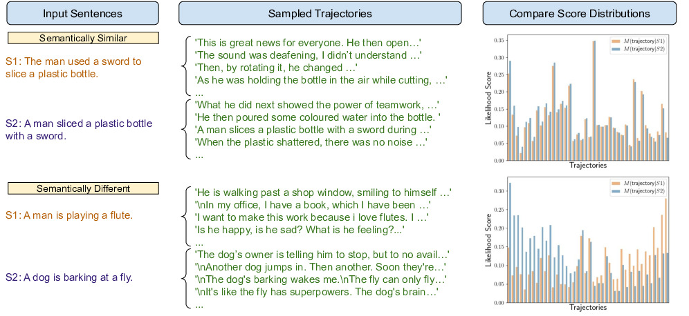

# Meaning Representations from Trajectories in Autoregressive Models


Official code repository for [Meaning Representations from Trajectories in Autoregressive Models](https://arxiv.org/pdf/2310.18348.pdf)

Authors: Tian Yu Liu, Matthew Trager, Alessandro Achille, Pramuditha Perera, Luca Zancato, Stefano Soatto 

### Requirements
Our repository is based on PyTorch. We use Torch 2.0.1 and Python 3.9, other versions have not been tested.

In addition, to load pretrained models and datasets, the following packages are also needed:
```
pip install transformers==4.31.0
pip install datasets==2.13.1
```

If you wish to use LLaMA-style models, please add them to the `pretrained/` directory 
in the root folder like so:
```
{project_root}/pretrained/LLaMa/7B
{project_root}/pretrained/LLaMa/13B
{project_root}/pretrained/LLaMa/33B
```

For image-image and image-text similarity experiments, you will 
also require LLaVA, which
can be installed via `pip` following the instructions in the 
original respository: https://github.com/haotian-liu/LLaVA/

### Set up datasets
Datasets for all text-to-text experiments are downloaded automatically
from HuggingFace. These include STS-B, STS12-16, and SICK-R datasets.

To set up the Crisscrossed Captions dataset for image-to-image and 
image-to-text experiments, first create
please follow the official instructions from
https://github.com/google-research-datasets/Crisscrossed-Captions
and store the resulting SIS csv and SITS json outputs respectively in
```
{project_root}/data/cxc/sis_val.csv
{project_root}/data/cxc/sits_val_combined.json
```
In addition, add/link the COCO dataset to
```
{project_root}/data/coco/
```


### Running the code
#### Semantic Textual Similarity
Both our prompted and prompt-free results can be reproduced using 
```
bash scripts/run_text2text.sh
```
and changing the `model` variable appropriately.

If not already available in the code, additional models can be added simply by
appending a new model to `utils.py` under the `get_model()` function

#### Semantic Image-Image and Image-Text Similarity
Our results on image-to-image and image-to-text datasets can 
respectively be reproduced with
```
python image2image_main.py llava trajectory
python image2text_main.py llava trajectory
```
Additionally, prompted results on image-to-text can be obtained via
```
python image2text_main.py llava trajectory --image_prompt "Describe this image." --text_prompt " This is a caption for an image. Describe this image." --post_image_prompt "The image shows" --post_text_prompt "The image shows"
```

#### Asymmetric Entailment Relations
Our results on the SNLI-Entailment dataset for measuring asymmetric
relations can be reproduced with
```
python entailment_main ${model} trajectory
```
and changing the `model` variable appropriately.

---

If you find this useful for your work, please consider citing
```
@article{liu2023meaning,
  title={Meaning Representations from Trajectories in Autoregressive Models},
  author={Liu, Tian Yu and Trager, Matthew and Achille, Alessandro and Perera, Pramuditha and Zancato, Luca and Soatto, Stefano},
  journal={arXiv preprint arXiv:2310.18348},
  year={2023}
}
```
